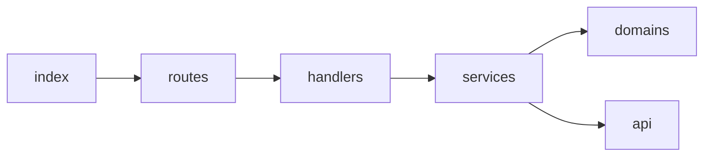
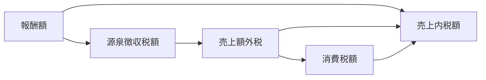
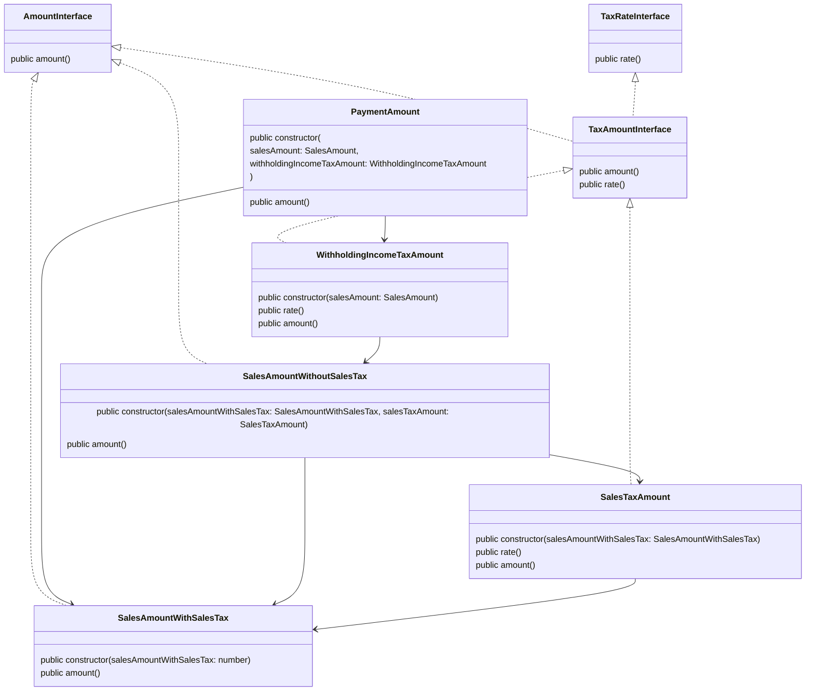

# bun-line-bot-tax-calc.ts

## Requirement

https://bun.sh/

## Install

```bash
bun install
```

## Run

```bash
bun start
```

## Directory Overview


```mermaid
flowchart LR
  index --> routes
  routes --> handlers
  handlers --> services
  services --> domains
  services --> api
```


```mermaid
graph LR
  報酬額 --> 売上内税額
  報酬額 --> 源泉徴収税額
  売上額外税 --> 売上内税額
  売上額外税 --> 消費税額
  消費税額 --> 売上内税額
  源泉徴収税額 --> 売上額外税
```


```mermaid
classDiagram
  AmountInterface <|.. TaxAmountInterface
  TaxRateInterface <|.. TaxAmountInterface
  AmountInterface <|.. SalesAmountWithSalesTax
  AmountInterface <|.. SalesAmountWithoutSalesTax
  TaxAmountInterface <|.. SalesTaxAmount
  TaxAmountInterface <|.. WithholdingIncomeTaxAmount

  PaymentAmount --> SalesAmountWithSalesTax
  PaymentAmount --> WithholdingIncomeTaxAmount
  WithholdingIncomeTaxAmount --> SalesAmountWithoutSalesTax
  SalesAmountWithoutSalesTax --> SalesAmountWithSalesTax
  SalesAmountWithoutSalesTax --> SalesTaxAmount
  SalesTaxAmount --> SalesAmountWithSalesTax

  class AmountInterface {
    public amount()
  }
  class TaxRateInterface {
    public rate()
  }
  class TaxAmountInterface {
    public amount()
    public rate()
  }
  class PaymentAmount {
    public constructor(
      salesAmount: SalesAmount, 
      withholdingIncomeTaxAmount: WithholdingIncomeTaxAmount
    )
    public amount()
  }
  class SalesAmountWithSalesTax {
    public constructor(salesAmountWithSalesTax: number)
    public amount()
  }
  class SalesAmountWithoutSalesTax {
    public constructor(salesAmountWithSalesTax: SalesAmountWithSalesTax, salesTaxAmount: SalesTaxAmount)
    public amount()
  }
  class SalesTaxAmount {
    public constructor(salesAmountWithSalesTax: SalesAmountWithSalesTax)
    public rate()
    public amount()
  }
  class WithholdingIncomeTaxAmount {
    public constructor(salesAmount: SalesAmount)
    public rate()
    public amount()
  }
```